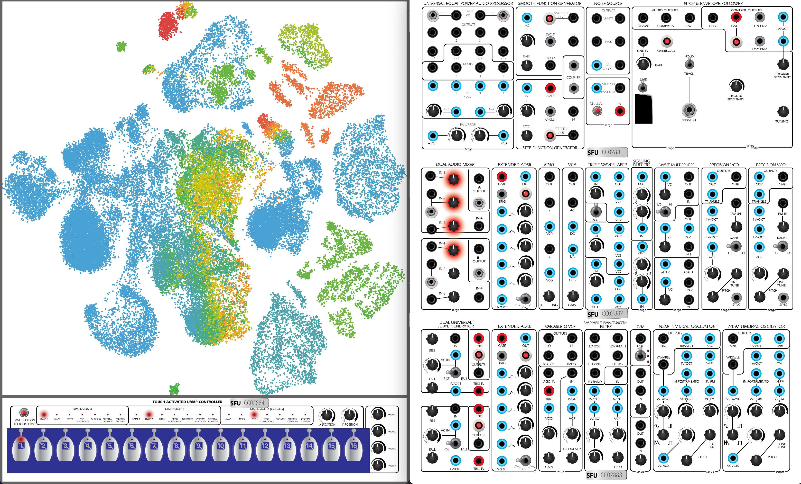

# Serge Modular Archive Instrument

(it's a working title)

The _Serge Modular Archive Instrument_ is created by [Jean Brazeau](https://221a.ca/contributors/jean-brazeau/) and [Ted Moore](https://www.tedmooremusic.com/). It is a sample-based computer emulation of selected patches on the vintage Serge Modular instrument that is housed at Simon Frasier University in Vancouver, Canada. The project is conceived of as both an instrument for sonic exploration and an archive of the sound worlds made by this 50+ year old instrument, including (or highlighting) all of the idiosyncrasies it has accumulated over the years.

## Recording & Analysis

For each patch included (currently there are five) we recorded tens of thousands of one-second samples of different parameter settings by systematically stepping through parameter combinations (sent to the Serge using the [Expert Sleepers ES-3](https://www.expert-sleepers.co.uk/es3.html). These samples were then analyzed using the [FluCoMa](https://www.flucoma.org/) Toolkit for analyses such as [pitch](https://learn.flucoma.org/reference/pitch/), [spectral descriptors](https://learn.flucoma.org/reference/spectralshape/), [timbral descriptors](https://learn.flucoma.org/reference/mfcc/), [loudness](https://learn.flucoma.org/reference/loudness/), and more. The data set created is then reduced to two dimensions using [PCA](https://learn.flucoma.org/reference/pca/) and then [UMAP](https://learn.flucoma.org/reference/umap/).

## Control 

These audio samples can then be accessed by navigating a two-dimensional plot (plus color), which can show the sound samples according to pitch, pitch confidence, loudness, spectral centroid, spectral flatness, or either of the two UMAP dimensions. 

Additionally, a skeuomorph of the Serge Modular highlights which knobs control the synthesis parameters used, allowing the user to imitate controlling the vintage instrument. Beneath the two-dimensional plot there is a step sequencer for storing chosen samples to be returned to in sequence.

All of the control parameters (including _x_ and _y_ plot navigation, skeuomorph knobs, and step sequencer) are controllable via MIDI and OSC allowing user defined control of the instrument.

## License

The license for the code is BSD-3 while the license for the audio files and accompanying data licensed under Creative Commons [Attribution 4.0 International](http://creativecommons.org/licenses/by/4.0/).

## Building

Currently, this project exists in XCode without a separate makefile.

### Dependencies for Building

* [openFrameworks](https://openframeworks.cc/) (and this repo needs to be in the appropriate `myApps` folder in the openFrameworks folder)

### Dependencies for generating some material used when building:

Some media and data used in the build is already in the repo and doesn't need to be remade, these media were created using the dependencies below, but hopefully these dependencies can be replaced with Python soon.

* [Processing](https://processing.org/) (only for analyzing the skeuomorph graphics when they are updated--there are plans to get rid of this dependency, replacing it with a Python script)
* [SuperCollider](https://supercollider.github.io/) (same as above, only for analyzing the skeuomorph graphics when they are updated--there are plans to get rid of this dependency, replacing it with a Python script--the same Python script as mentioned above)
