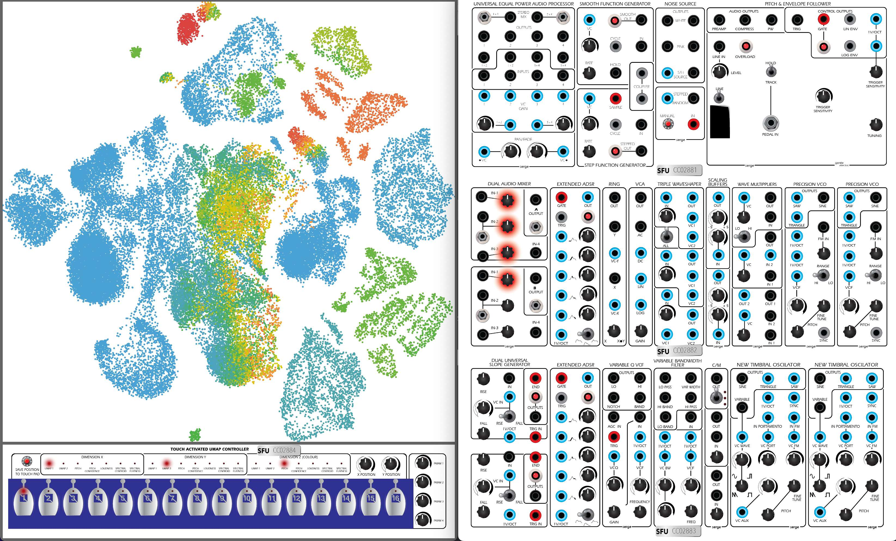
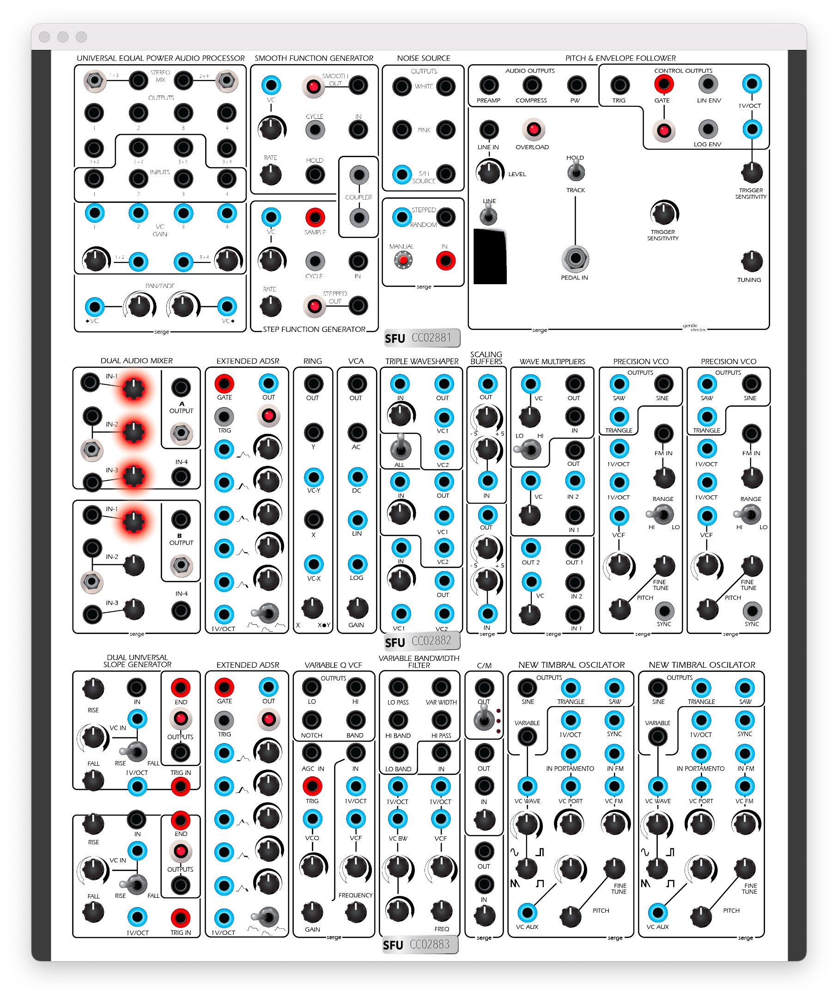
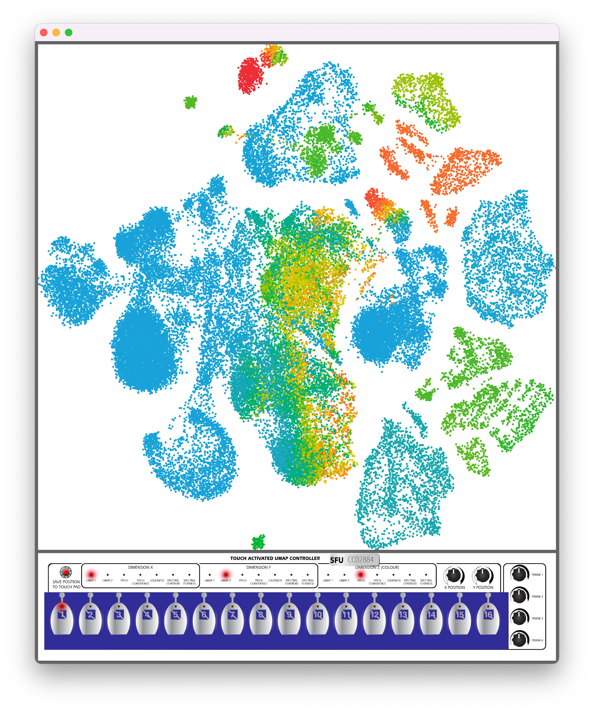

\pagebreak

\

# Introduction

The Serge Modular Archive Instrument (SMAI) is a sample-based computer emulation of selected patches on the vintage Serge Modular instrument that is housed at Simon Fraser University. Hours of recorded audio created by specified parameter combinations have been analyzed using audio descriptors and machine learning algorithms in the FluCoMa toolkit. These samples are controlled via (1) a machine learning dimensionality reduction [plot](#3-dimensional-plot) showing all the recorded samples and/or (2) a [skeuomorphic](#skeuomorph) graphical user interface of the patches used to record the sounds. Flexible [MIDI and OSC control](#midi-and-osc-control) of the software enables custom modulation and performance of this archive from outside the software. Differing from many software synthesis-based emulations, the SMAI aims to capture and archive the idiosyncrasies of vintage hardware as digital audio samples; compare and contrast skeuomorphic and machine learning enabled modes of exploring vintage sounds; and create a flexible instrument for creatively performing this archive.

Download SMAI from the [GitHub Repo](https://github.com/tedmoore/Serge-Modular-Archive-Instrument).

# Making Sound

## Getting Started

Once the software has been downloaded, begin by double clicking the icon. The first window to appear will be an open dialog that will ask you to select a folder that has all the necessary files for SMAI to load a patch. These "Patch Folders" can be downloaded from a [link](https://drive.google.com/drive/folders/1LRe2oOUYgVRhTToPmIJWTU4CTBDvpJhz) on the [GitHub README](https://github.com/tedmoore/Serge-Modular-Archive-Instrument/blob/main/README.md)

The "Patch Folder" will include: 

* `wav` audio files of the recorded Serge
* a `csv` file containing audio analyses and parameter positions for each sound slice (see [Controlling Sound](#gui-controls) for more)
* a `json` file containing some information about how the patch was created and how to display the skeuomorph
* a `png` file to overlay on the skeuomorph showing a mock up of the cable connections used during recording (we're still working on making these...)

Once that folder is highlighted (not a _file_ in the folder, but the _folder_ itself), click open and the SMAI will load the data (this may take a short while).

### Selecting a MIDI Device

The next window that pops up will show you all the connected MIDI devices SMAI has found and allow you to select one by pressing the number on your QWERTY keyboard that is next to the device you wish to select (it should turn red). Hit `m` on the QWERTY keyboard to close this window (and reopen it later if you want). Selecting a MIDI device is optional--you may close this window without selecting a device and proceed to use SMAI.

## GUI Controls

### Skeuomorph

In order to provide a sense of what kind of analog patch produced the sounds being heard, a skeuomorphic interface allows users to see what interconnections were used and adjust virtual knobs to control the sound. A red glow shows which knobs are adjustable, while the rest will not respond to interaction. Each time one of these knobs is moved, a KDTree is used to find the nearest neighbor of the current parameter settings within the dataset of sound slices loaded (these parameter settings are loaded through the `csv` file) and the SMAI loops the corresponding one second sample of audio. The [three-dimensional plot](#3-dimensional-plot) shows the position of the slice being heard.

\

### 3 Dimensional Plot

A three-dimensional plot (`x` and `y`, with color as a third dimension) allows for a more spatial and similarity-based interface for accessing the sounds slices. Each time the mouse is clicked or dragged on the plot a KDTree is used to find the nearest point to the current mouse position (only the `x` and `y` dimensions are considered). The one second audio recording of the nearest point is then looped and the original parameter combination is displayed via the knobs on the [skeuomorph](#skeuomorph). The three-dimensional plot can display, on any axis, various [audio descriptors](#audio-analysis) representing the sound slices (pitch, pitch confidence, loudness, spectral centroid, and spectral flatness, or either of the two [UMAP](#dimensionality-reduction-with-pca-and-umap) dimensions). This allows for viewing, navigating, and performing the sound slices from multiple angles. Users may find different combinations of axes to be more musically intuitive (e.g., spectral centroid and loudness as a spectrogram), to reveal clusters of similar sounds (e.g., UMAP), or to be more [performable via MIDI or OSC](#midi-and-osc-control).

\

### Touch Activated Keyboard Sequencer

Below the three-dimensional [plot](#3-dimensional-plot) is a set of controls for the plot itself, four knobs that mirror the four knobs on the Serge Modular [skeuomorph](#skeuomorph), and a skeuomorph of a Serge Touch Activated Keyboard Sequencer. This sequencer allows the user to store specific sound slices in one of the sixteen steps and then recall them by clicking on a given step (similar to the original analog device). 

To store a desired sound:

1. Use the three-dimensional plot or the Serge skeuomorphic interface to navigate to a sound
2. Press the digital button labeled "Save Position to Touchpad"
3. Click on which of the sixteen steps in which it should be stored

While this sequencer does not have a tempo or step advancement control, it is [controllable via MIDI and OSC](#midi-and-osc-control) (see below). The benefit of having 16 settable presets in the SMAI is that one can natively select and store 16 of the tens of thousands of possible sounds with a interactive GUI and then trigger those 16 sounds programmatically from a different software

## MIDI and OSC Control

Rather than add a limited set of modulation sources, such as LFOs, to the SMAI we decided to maximize the controllability of the software by opening up all the parameters for control via MIDI and OSC. Users are able to design their own LFOs, gestural mappings, sequencing strategies, and other performative techniques in exiting tools such as Max, SuperCollider, or Pure Data and send control information to the SMAI. See the tables below for the relevant MIDI Messages and OSC commands.

\begin{table}[h]
\begin{center}
\begin{tabular}{|l|c|c|}
\hline
\textbf{Action} & \textbf{MIDI} & \textbf{Args} \\
\hline
Skeuomorphic Param 1 & CC 1 & 0-127 \\
\hline
Skeuomorphic Param 2 & CC 2 & 0-127 \\
\hline
Skeuomorphic Param 3 & CC 3 & 0-127 \\
\hline
Skeuomorphic Param 4 & CC 4 & 0-127 \\
\hline
X Position on Plot & CC 5 & 0-127 \\
\hline
Y Position on Plot & CC 6 & 0-127 \\
\hline
Set X Axis & CC 101 & 0-6 \\
\hline
Set Y Axis & CC 102 & 0-6 \\
\hline
Set Color "Axis" & CC 103 & 0-6 \\
\hline
Step Seq. Step "`n`" & Note On note 59 + `n` & n/a \\
\hline
Step Seq. Advance & Note On note 100 & n/a \\
\hline
\end{tabular}
\end{center}
\caption{Controlling the SMAI with MIDI.}
\label{tab:midi-commands}
\end{table}

\begin{table}[h]
\begin{center}
\begin{tabular}{|l|c|c|}
\hline
\textbf{Action} & \textbf{OSC} & \textbf{Args} \\
\hline
Skeuomorphic Param 1 & /param1 & 0-1 (float) \\
\hline
Skeuomorphic Param 2 & /param2 & 0-1 (float) \\
\hline
Skeuomorphic Param 3 & /param3 & 0-1 (float) \\
\hline
Skeuomorphic Param 4 & /param4 & 0-1 (float) \\
\hline
X Position on Plot & /x & 0-1 (float) \\
\hline
Y Position on Plot & /y & 0-1 (float) \\
\hline
Set X Axis & /x-axis & 0-6 (int) \\
\hline
Set Y Axis & /y-axis & 0-6 (int) \\
\hline
Set Color "Axis" & /color-axis & 0-6 (int) \\
\hline
Step Seq. Step "`n`" & /step-seq & `n` (int) \\
\hline
Step Seq. Advance & /step-seq-advance & n/a \\
\hline
\end{tabular}
\end{center}
\caption{Controlling the SMAI with OSC.}
\label{tab:osc-commands}
\end{table}

### MIDI Learn

Additionally, a MIDI learn functionality allows for assigning Control Change numbers (other than the reserved ones found in table) to control [plot](#3-dimensional-plot) navigation (`x` and `y` axis) and the four [skeuomorphic](#skeuomorph) knobs. The user can specify which connected MIDI controller to use with the SMAI by hitting `m` (for "MIDI"). This allows a user to quickly make and control sound with physical knobs on any attached MIDI controller.

## Audio Playback

Looping the one second sound slice is executed with a 50 millisecond fade in and fade out. The next loop starts to fade in when the previous begins fading out. When a new sound slice is selected to be heard, either with the skeuomorphic controls or the two-dimensional plot, the previous slice begins fading out at the same time the chosen slice begins fading in. This sample cross-fading strategy allows for convincing and fluid movement between sound slices that approximates the sound of turning a knob on an analog system.

# How does this all work? 

## Recording the Analog Serge

For each patch created, four modulatable control voltage parameters were chosen on the Serge so each could be programmatically set to specific values (as voltage) via the Expert Sleepers ES-9 eurorack module. A SuperCollider script programmatically stepped through all possible combinations of the four parameters. For each of the four parameters a minimum and maximum voltage (potentially ranging from -10 volts to +10 volts as output by the ES-9; specified in SuperCollider from -1 to 1) and a number of steps for dividing up the voltage range (usually 10-15) is selected. We often choose a resolution of 15 steps for each parameter, which results in 50,625 ($15^4$) possible parameter combinations. (For explanation purposes, this paper describes the specifics of one dataset, or "patch". Other datasets have slightly different settings.) A voltage range smaller than -10 to +10 was used in cases where a certain parameter was mostly inaudible in a given range such as an oscillator frequency above the range of human hearing. After each parameter combination is sent to the Serge, a specified duration of time is waited for the recording to capture audio. Each of the 50,625 parameter combinations is recorded for one second, creating over 14 hours of recorded audio (this had to be broken up into multiple `wav` files for proper storage and transmission). Due to the need to balance audio quality with file size we chose to record at a sample rate of 44,100 Hz and bit depth of 16, which resulted in over 4 gigabytes of audio. During this process, the recording settings, number of steps, voltage ranges, and recording time were stored in a log file; the parameter combinations were stored as a CSV file; and a log of the patch cables' connections were all stored for future use.

## Audio Analysis

Using the hours of recorded audio, audio analyses were conducted in non-real-time on each parameter combination's one second of audio. The audio analysis and machine learning analyses were achieved with the FluCoMa Toolkit in SuperCollider. Each one second of audio was analyzed for spectral centroid, spectral spread, spectral skewness, spectral kurtosis, spectral rolloff, spectral flatness, spectral crest, pitch, pitch confidence, loudness, true peak, and 40 mel-frequency cepstral coefficients (including coefficient zero). Each analysis used a window size and FFT size of 1024 samples, with a hop size of 512 samples. The FluCoMa analysis returns a time series of each of these audio descriptors across the duration of the one second sound slice (one descriptor value per FFT frame). In order to summarize the time series of descriptors, a statistical summary was conducted on each, returning the mean, standard deviation, skewness, kurtosis, minimum, median, and maximum values for each descriptor. These seven statistics for each of the 51 descriptors' time series was used as the raw vector (of 357 dimensions) for each sound slice analyzed.

## Dimensionality Reduction with PCA and UMAP

After performing the audio analyses, the sound slices were represented as 50,625 points in 357 dimensional space. Dimensionality reduction algorithms were used to organize these sound slices into two dimensional space for plotting and navigating in the SMAI software. Because of the large variance in ranges of the different audio descriptors (e.g., spectral centroid in hertz from 20 to 20,000 while pitch confidence ranges between 0 and 1) it was important to first scale the dataset using standardization so each dimension would have a mean of 0 and standard deviation of 1. This ensures that each dimension will be weighted relatively equally in the distance computations that follow. Because MFCCs are 40 of the 51 audio descriptors, their timbral descriptions constitute the majority of the distance computation between points. The designers felt that this weighting was not inappropriate. Future experiments might vary weights between different kinds of analyses. Principal Component Analysis was first used with the goal of removing any noise or redundancy in the dataset. A target of preserving 95% of the variance was set, which resulted in keeping the first 226 principal components, reducing the size of the dataset by about 37%. Next, the machine learning dimensionality reduction algorithm Uniform Manifold Approximation and Projection (UMAP) was used to reduce the 226 principal components down to two dimensions for plotting in SMAI. Various UMAPs parameters were tested to find a two dimensional projection that felt musical and useful to the authors. The resulting parameters used were number of neighbors = 2, minimum distance = 1, iterations = 200, learning rate = 0.1. Future research should include a qualitative assessment of musicality by more users with more varied UMAP parameters.